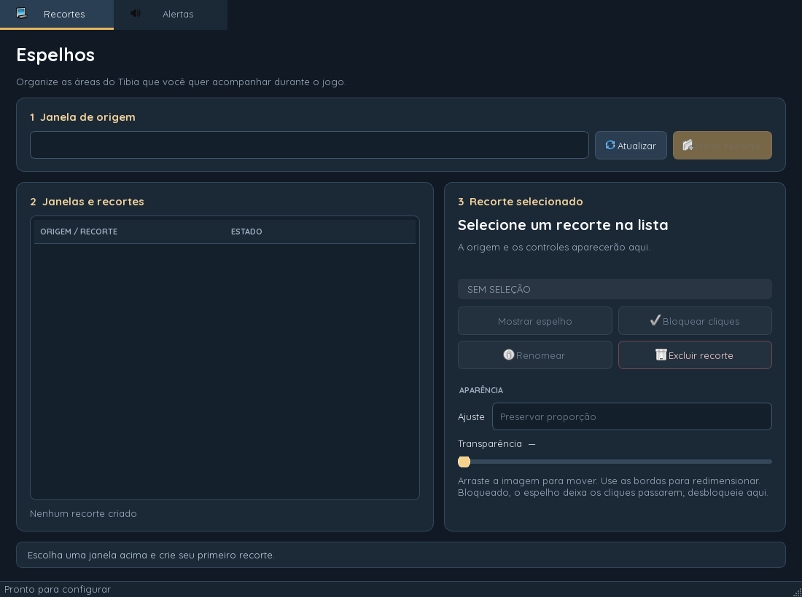
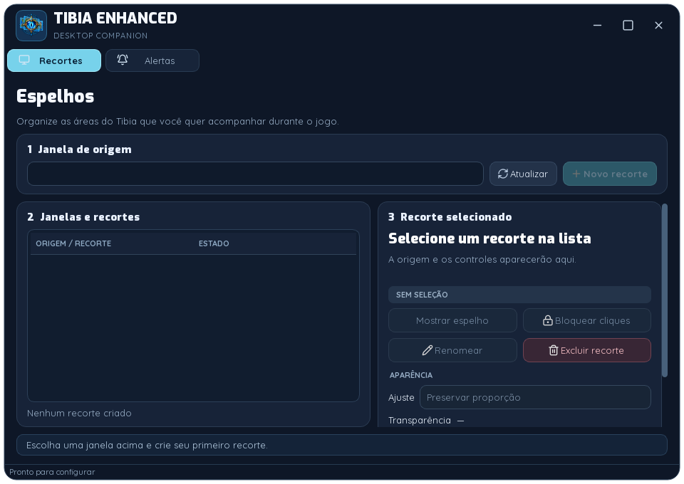
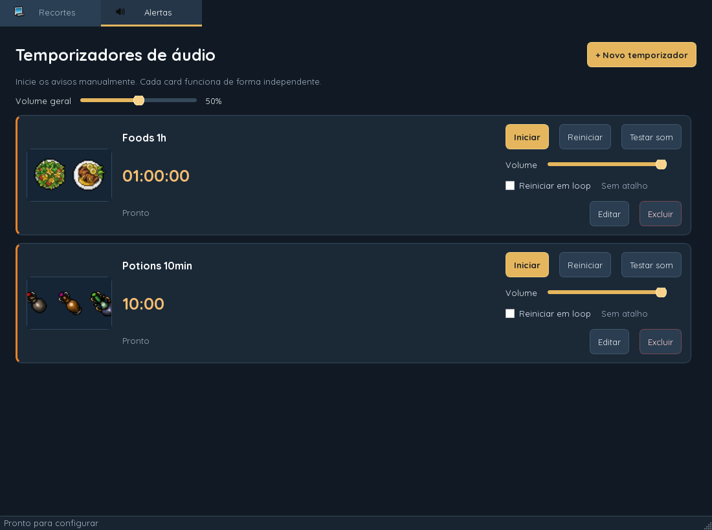
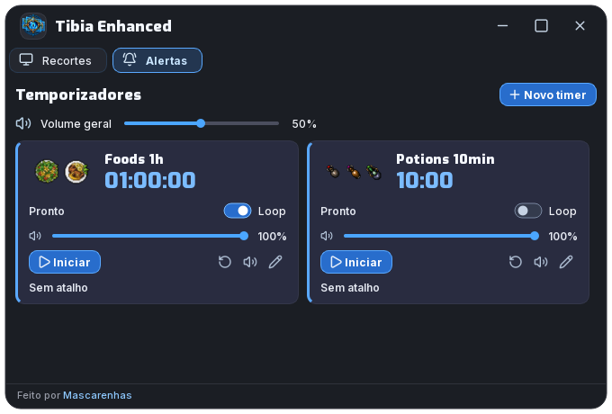
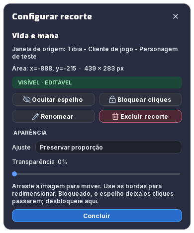
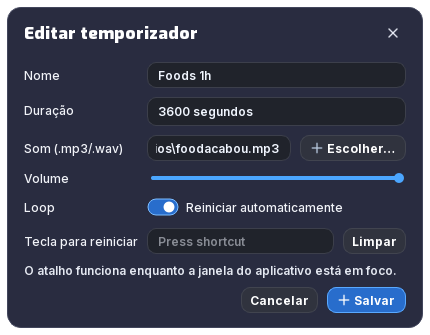

# Redesign visual da issue #9

Interface PySide6 inspirada na densidade visual da referência TibiaVision: fundo grafite, cards violeta escuro, destaques azuis e controles compactos. A janela abre em 680 × 460 e pode ser reduzida a 560 × 380, com rolagem do conteúdo.

- **Exo 900** nos títulos e **Inter** nos textos e controles, distribuídas localmente com suas licenças OFL.
- Ícones **Lucide** com tooltips e nomes acessíveis. Botões, abas, combos e sliders usam cursor de mão quando habilitados.
- Recortes em grade, com mostrar/ocultar, bloqueio, exclusão e opacidade diretamente no card. O lápis abre as configurações detalhadas.
- Temporizadores em grade adaptável, com iniciar/pausar, volume, loop, teste de som e edição do atalho. Os sliders de áudio e de recortes usam tons de azul.
- O Loop usa um interruptor arredondado nos cards e no diálogo de edição. Foods e Potions são temporizadores padrão e não podem ser excluídos; apenas os timers criados pelo usuário mostram a ação de excluir.
- Sliders com trilho fino arredondado, mantendo interação nativa por teclado e arraste.
- Barra de título própria com ícone, minimizar, maximizar e fechar; bordas redimensionáveis.
- Rodapé “Feito por Mascarenhas”, com link para o GitHub do autor.
- Diálogos de recorte, renomeação e temporizador usam cabeçalho próprio, cantos arredondados e texto branco com peso maior.

## Comparação visual

As imagens atuais são renderizações Qt com dados fictícios para os recortes. As imagens anteriores usaram Quicksand apenas para permitir a leitura no renderizador; a versão original usava Segoe UI.

| Tela | Antes | Depois |
| --- | --- | --- |
| Recortes |  |  |
| Alertas |  |  |

 

Os testes cobrem os controles independentes dos recortes, temporizadores, fontes, cursores, geometria e rolagem. A renderização offscreen não valida o arraste nativo da janela nem a captura DWM real do jogo.
