# Design e legibilidade

## Interface atual

A revisão de legibilidade usa superfícies grafite neutras e azul suave nos controles. Segoe UI recebe a renderização padrão do Windows; o aplicativo não força FreeType nem desativa a suavização subpixel. Texto principal de 14 px, apoio de 13 px e títulos de página de 24 px distinguem conteúdo e ações sem aplicar negrito a todos os textos.

A janela inicial de 940 × 600 tem navegação lateral, perfil agrupado no cabeçalho, toolbars para origem e volume e estados vazios com uma única orientação. Cards adaptam as colunas à largura disponível, respeitam a altura do conteúdo e abreviam nomes longos com tooltip. Os diálogos seguem a mesma paleta, tipografia e espaçamento.

O botão **Modo claro / Modo escuro** no fim da barra lateral alterna sem reiniciar timers ou recriar recortes. O tema claro usa fundo cinza suave, superfícies brancas e texto escuro, com ações azuis. A preferência é global e fica no campo opcional `theme` do arquivo local de perfis; configurações antigas continuam abrindo no tema escuro. Cores dos ícones e dos controles desenhados em Qt acompanham a troca, inclusive em diálogos que já estão abertos.

As prévias abaixo foram renderizadas pelo próprio aplicativo no backend nativo do Windows. Os recortes usam dados fictícios, sem iniciar espelhos do jogo.

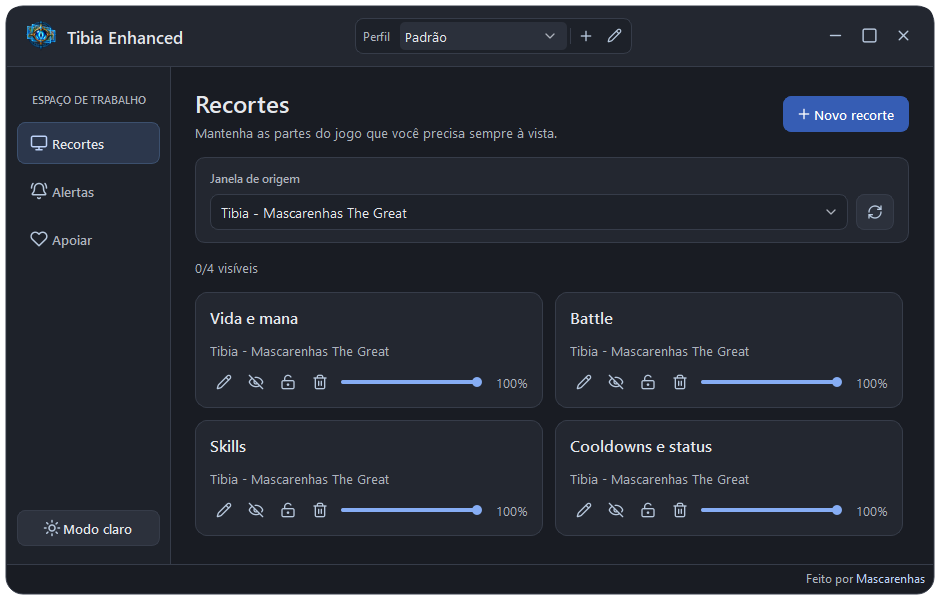

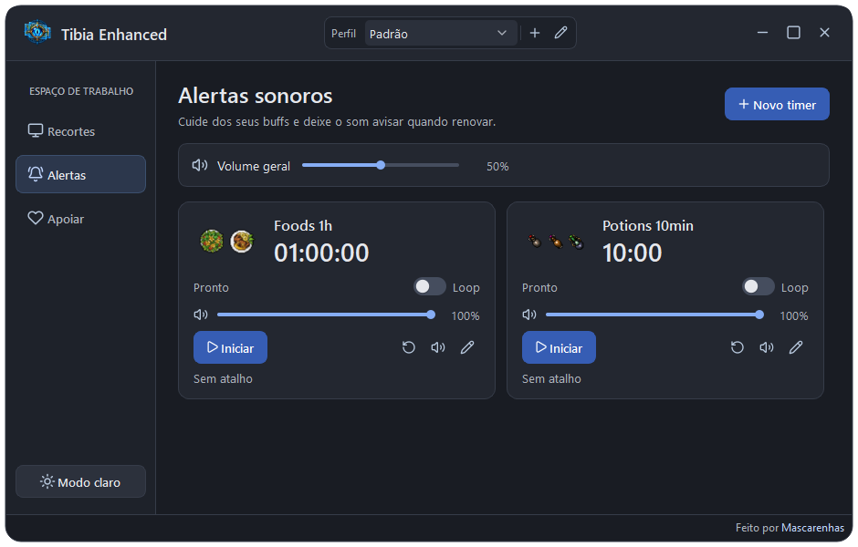

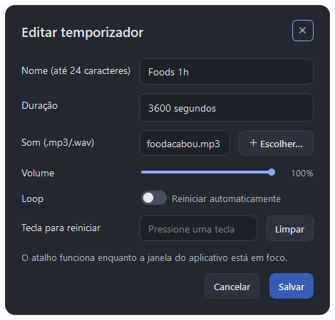

### Tema claro

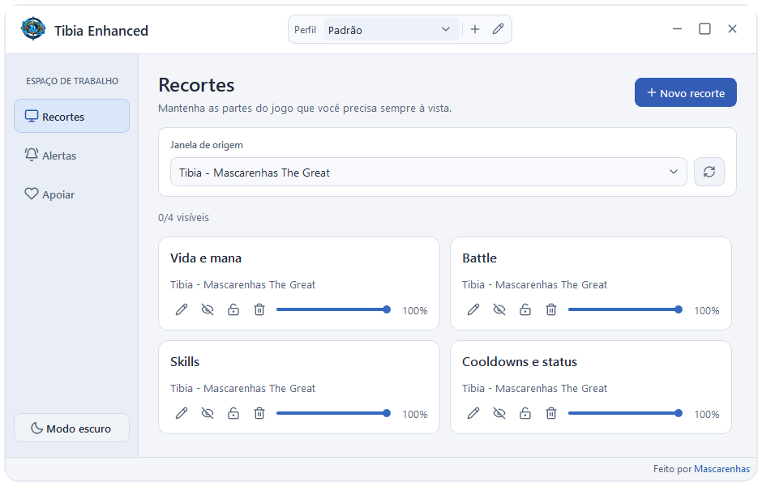

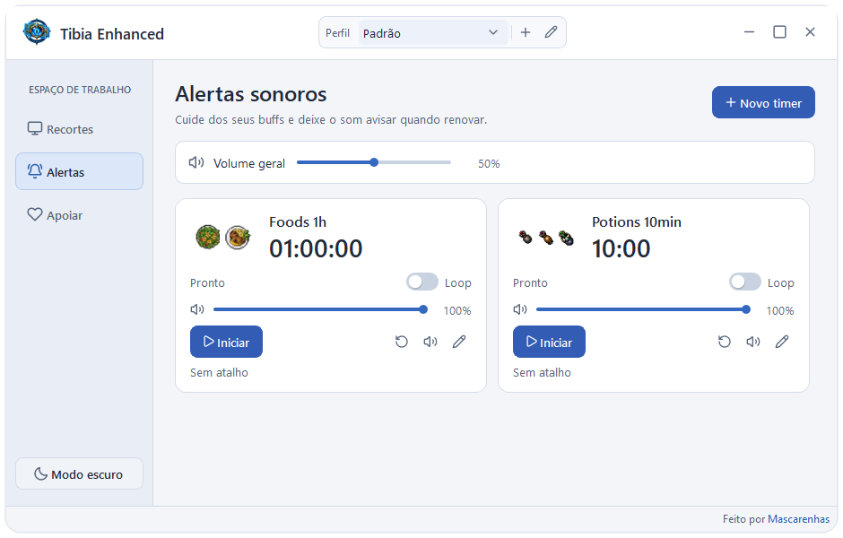

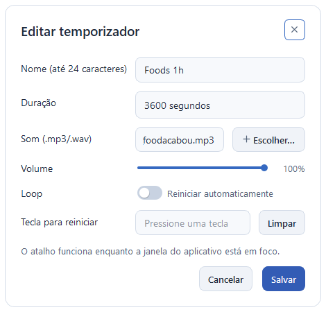

Os testes incluem contraste de texto, navegação, limites de layout, títulos longos, largura fixa dos percentuais e interação dos sliders. A inspeção visual também inclui a escala de 150% do Windows.

## Histórico da issue #9

Interface PySide6 com fundo grafite, cards neutros, destaque em verde água e controles compactos. A janela abre em 680 × 460 e pode ser reduzida a 560 × 380, com rolagem do conteúdo. A versão azul anterior permanece nas capturas para comparação.

- **Space Grotesk 700** nos títulos e **DM Sans** nos textos e controles, distribuídas localmente com suas licenças OFL.
- Ícones **Lucide** com tooltips e nomes acessíveis. Botões, abas, combos e sliders usam cursor de mão quando habilitados.
- Recortes em grade, com mostrar/ocultar, bloqueio, exclusão e opacidade diretamente no card. O lápis abre as configurações detalhadas.
- O seletor de janela de origem mostra seta, instrução e nomes abreviados quando longos; o nome completo fica no tooltip e a lista aberta respeita a largura do campo.
- Temporizadores em grade adaptável, com iniciar/pausar, volume, loop, teste de som e edição do atalho. Os sliders de áudio e de recortes usam verde água.
- O Loop usa um interruptor sem contorno, com trilho azul, botão circular, transição de 170 ms e resposta visual ao hover, clique e foco. Foods e Potions são temporizadores padrão e não podem ser excluídos; apenas os timers criados pelo usuário mostram a ação de excluir.
- Sliders com trilho fino arredondado, mantendo interação nativa por teclado e arraste.
- Botões principais, cards e trilhos de volume respondem ao hover com transições curtas; os percentuais têm largura reservada para a barra não mudar de tamanho.
- Barra de título própria com ícone, minimizar, maximizar e fechar; bordas redimensionáveis.
- Rodapé “Feito por Mascarenhas”, com link para o GitHub do autor.
- Diálogos de recorte, renomeação e temporizador usam cabeçalho próprio, cantos arredondados e texto branco com peso maior.

## Comparação visual

As imagens atuais são renderizações Qt com dados fictícios para os recortes. As imagens anteriores usaram Quicksand apenas para permitir a leitura no renderizador; a versão original usava Segoe UI.

| Tela | Azul anterior | Experimento verde água |
| --- | --- | --- |
| Recortes |  | 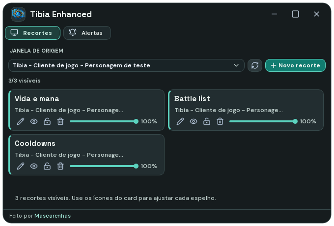 |
| Alertas |  | 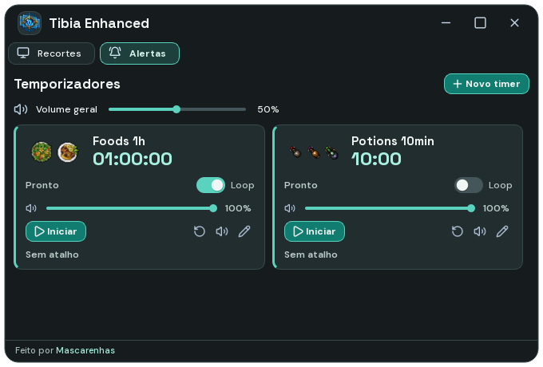 |

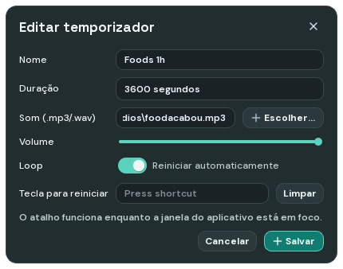

 

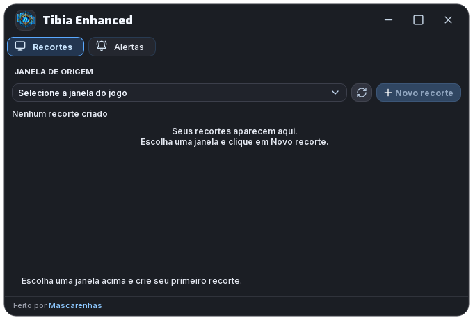 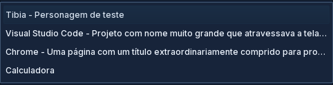 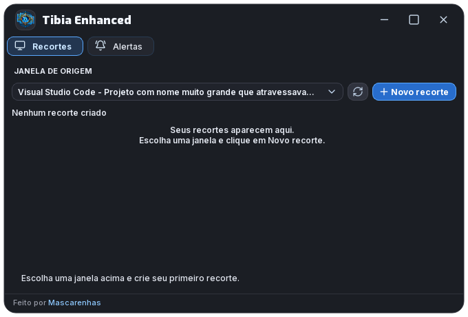

Os testes cobrem os controles independentes dos recortes, temporizadores, fontes, cursores, geometria e rolagem. A renderização offscreen não valida o arraste nativo da janela nem a captura DWM real do jogo.
